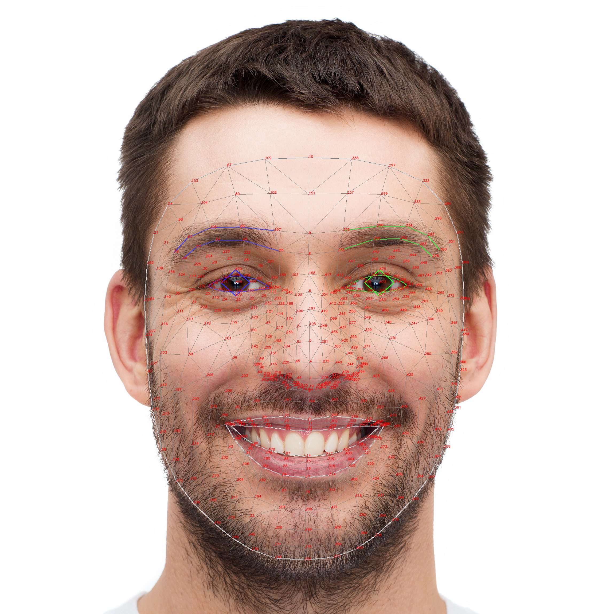

# MediaPipe Face & Pose Landmarks

The legacy `mediapipe.solutions.holistic` API (single-pass face + pose + hands) is **deprecated**. The Tasks API replacement is to run three separate landmarkers — `FaceLandmarker`, `PoseLandmarker`, and `HandLandmarker` — on the same frame.

The 21 hand landmarks are covered in [MediaPipe Hand Landmarks](mediapipe_points_mapped.md). This document covers the other two: **478 face points** and **33 pose points**.

---

## Face Landmarker

The Face Landmarker outputs **478 3D landmarks** per detected face, plus optional 52-value blendshape coefficients and a 4×4 facial transformation matrix.

### Landmark Diagram




### Coordinate System

Each of the 478 landmarks is a `NormalizedLandmark` with:

| Field | Range | Meaning |
| ----- | ----- | ------- |
| `x` | 0.0 – 1.0 | Horizontal position, normalized by image width |
| `y` | 0.0 – 1.0 | Vertical position, normalized by image height (y = 0 is top) |
| `z` | roughly ±0.1 | Depth relative to the face center; smaller (more negative) = closer to camera |

Unlike pose landmarks, face landmarks have **no** `visibility` or `presence` fields — the face mesh is either detected as a whole or not at all.

### How the 478 points break down

| Index range | Group | Notes |
| ----------- | ----- | ----- |
| 0 – 467 | Canonical face mesh (MediaPipe Face Mesh) | The classic 468-point topology — same indices the older `face_mesh` solution used |
| 468 – 472 | **Right iris** (5 points) | Center + 4 rim points; only present with the refined model (default in Tasks API) |
| 473 – 477 | **Left iris** (5 points) | Same structure as the right iris |

### Key regions (canonical indices)

The 468-point mesh has standard index sets for each facial region. These are the ones most useful for sign language (eyebrows, mouth shape, and gaze can disambiguate expressions and intent):

#### Face oval (outline of the face)

```
10, 338, 297, 332, 284, 251, 389, 356, 454, 323, 361, 288, 397, 365, 379, 378,
400, 377, 152, 148, 176, 149, 150, 136, 172, 58, 132, 93, 234, 127, 162, 21,
54, 103, 67, 109
```

#### Lips (outer contour)

```
61, 146, 91, 181, 84, 17, 314, 405, 321, 375, 291,
185, 40, 39, 37, 0, 267, 269, 270, 409
```

#### Lips (inner contour)

```
78, 95, 88, 178, 87, 14, 317, 402, 318, 324, 308,
191, 80, 81, 82, 13, 312, 311, 310, 415
```

#### Right eye

```
33, 7, 163, 144, 145, 153, 154, 155, 133,
173, 157, 158, 159, 160, 161, 246
```

#### Left eye

```
263, 249, 390, 373, 374, 380, 381, 382, 362,
398, 384, 385, 386, 387, 388, 466
```

#### Right eyebrow

```
70, 63, 105, 66, 107, 55, 65, 52, 53, 46
```

#### Left eyebrow

```
300, 293, 334, 296, 336, 285, 295, 282, 283, 276
```

#### Irises (refined-mesh only, indices 468-477)

| Index | Location |
| ----- | -------- |
| 468 | Right iris center |
| 469-472 | Right iris rim (top, right, bottom, left) |
| 473 | Left iris center |
| 474-477 | Left iris rim (top, right, bottom, left) |

The iris points let you compute gaze direction — useful if you ever extend the LSM model to lip-reading or attention cues.

### Blendshapes (52 expression coefficients)

When `output_face_blendshapes=True`, the landmarker also returns a list of 52 `Category` objects, each in 0-1:

| Group | Examples |
| ----- | -------- |
| Eyes | `eyeBlinkLeft`, `eyeBlinkRight`, `eyeLookDownLeft`, `eyeLookInLeft`, `eyeLookOutLeft`, `eyeLookUpLeft`, `eyeSquintLeft`, `eyeWideLeft` |
| Brows | `browDownLeft`, `browDownRight`, `browInnerUp`, `browOuterUpLeft`, `browOuterUpRight` |
| Mouth | `mouthSmileLeft`, `mouthFrownRight`, `mouthOpen`, `mouthPucker`, `mouthRollLower`, `mouthShrugUpper`, `mouthFunnel`, `mouthDimpleLeft`… |
| Jaw | `jawForward`, `jawLeft`, `jawRight`, `jawOpen` |
| Cheeks | `cheekPuff`, `cheekSquintLeft`, `cheekSquintRight` |
| Nose | `noseSneerLeft`, `noseSneerRight` |
| Tongue | `tongueOut` |

The first entry (index 0, `_neutral`) is always the residual after every other blendshape is applied.

### Facial transformation matrix

When `output_facial_transformation_matrixes=True`, you also get a 4×4 transformation matrix that maps the **canonical face model** to the **detected face** in this frame. This is what AR/effects code uses to render meshes that stick to a moving face — generally not needed for sign-language classification, but useful for visualization.

---

## Pose Landmarker

The Pose Landmarker outputs **33 3D landmarks** per detected person. Unlike face landmarks, pose landmarks carry per-point `visibility` (is the joint occluded?) and `presence` (does it exist in the frame at all?) — both in 0-1.

### Landmark Diagram


### Coordinate System

Each landmark has these fields:

| Field | Range | Meaning |
| ----- | ----- | ------- |
| `x` | 0.0 – 1.0 | Horizontal position, normalized by image width |
| `y` | 0.0 – 1.0 | Vertical position, normalized by image height |
| `z` | roughly ±0.5 | Depth relative to the **midpoint of the hips**; smaller = closer to camera |
| `visibility` | 0.0 – 1.0 | Likelihood the landmark is visible (not occluded) |
| `presence` | 0.0 – 1.0 | Likelihood the landmark exists in the image at all |

For sign language you'll mostly care about points **0-22** (head, shoulders, arms, hands); legs (23-32) are usually off-screen.

### All 33 landmarks

#### Face (0-10)

| Index | Name              | Location               |
| ----- | ----------------- | ---------------------- |
| 0     | NOSE              | Tip of the nose        |
| 1     | LEFT_EYE_INNER    | Inner corner, left eye |
| 2     | LEFT_EYE          | Left eye center        |
| 3     | LEFT_EYE_OUTER    | Outer corner, left eye |
| 4     | RIGHT_EYE_INNER   | Inner corner, right eye|
| 5     | RIGHT_EYE         | Right eye center       |
| 6     | RIGHT_EYE_OUTER   | Outer corner, right eye|
| 7     | LEFT_EAR          | Left ear               |
| 8     | RIGHT_EAR         | Right ear              |
| 9     | MOUTH_LEFT        | Left mouth corner      |
| 10    | MOUTH_RIGHT       | Right mouth corner     |

#### Upper body (11-22)

| Index | Name           | Location                       |
| ----- | -------------- | ------------------------------ |
| 11    | LEFT_SHOULDER  | Left shoulder                  |
| 12    | RIGHT_SHOULDER | Right shoulder                 |
| 13    | LEFT_ELBOW     | Left elbow                     |
| 14    | RIGHT_ELBOW    | Right elbow                    |
| 15    | LEFT_WRIST     | Left wrist                     |
| 16    | RIGHT_WRIST    | Right wrist                    |
| 17    | LEFT_PINKY     | Left pinky knuckle (MCP)       |
| 18    | RIGHT_PINKY    | Right pinky knuckle (MCP)      |
| 19    | LEFT_INDEX     | Left index knuckle (MCP)       |
| 20    | RIGHT_INDEX    | Right index knuckle (MCP)      |
| 21    | LEFT_THUMB     | Left thumb knuckle             |
| 22    | RIGHT_THUMB    | Right thumb knuckle            |

Points 17-22 are a **simplified hand stub**, just enough to know where each hand is in the body's coordinate system. For actual finger geometry use the Hand Landmarker (21 points per hand). The recommended way to fuse them: keep pose 15/16 as the wrist anchor and replace 17-22 with the full Hand Landmarker output.

#### Lower body (23-32)

| Index | Name             | Location          |
| ----- | ---------------- | ----------------- |
| 23    | LEFT_HIP         | Left hip          |
| 24    | RIGHT_HIP        | Right hip         |
| 25    | LEFT_KNEE        | Left knee         |
| 26    | RIGHT_KNEE       | Right knee        |
| 27    | LEFT_ANKLE       | Left ankle        |
| 28    | RIGHT_ANKLE      | Right ankle       |
| 29    | LEFT_HEEL        | Left heel         |
| 30    | RIGHT_HEEL       | Right heel        |
| 31    | LEFT_FOOT_INDEX  | Left big toe area |
| 32    | RIGHT_FOOT_INDEX | Right big toe area|

### World landmarks (`pose_world_landmarks`)

The Pose Landmarker also outputs a parallel `pose_world_landmarks` list with the same 33 points, but in **real-world metric coordinates**:

| Field | Units | Origin |
| ----- | ----- | ------ |
| `x`, `y`, `z` | meters | Midpoint of the hips (landmarks 23 and 24) |

This is the right input for any model that needs body proportions independent of the camera framing — wrist-to-shoulder distance in meters is the same whether the signer is close or far.

### Segmentation mask

When `output_segmentation_masks=True`, the landmarker also returns a per-pixel binary mask separating the person from the background. Useful for clean cutouts; not normally needed for sign-language feature extraction, so leave it off to keep results lighter.

---

## Putting it together: combined feature vector

When you fuse all three landmarkers for an LSM model, the conventional layout (matching the original Holistic-based sign-language papers) is:

| Group       | Per-point dims         | Points | Subtotal |
| ----------- | ---------------------- | ------ | -------- |
| Pose        | x, y, z, visibility    | 33     | 132      |
| Face        | x, y, z                | 478    | 1434     |
| Left hand   | x, y, z                | 21     | 63       |
| Right hand  | x, y, z                | 21     | 63       |
| **Per frame** |                      |        | **1692** |

Missing detections become zeros so the vector size stays constant. See [`references/mediapipe_holistic_reference.ipynb`](../../references/mediapipe_holistic_reference.ipynb) for an executable walkthrough.

---

## Official documentation

- [Face Landmarker](https://developers.google.com/edge/mediapipe/solutions/vision/face_landmarker)
- [Face Landmarker — Python guide](https://developers.google.com/edge/mediapipe/solutions/vision/face_landmarker/python)
- [Pose Landmarker](https://developers.google.com/edge/mediapipe/solutions/vision/pose_landmarker)
- [Pose Landmarker — Python guide](https://developers.google.com/edge/mediapipe/solutions/vision/pose_landmarker/python)
- [Holistic deprecation notice / migration path](https://ai.google.dev/edge/mediapipe/solutions/vision/holistic_landmarker)
