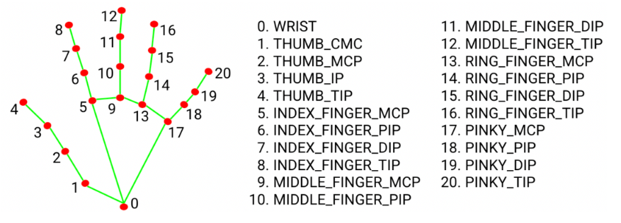

# MediaPipe Hand Landmarks

MediaPipe detects 21 landmarks on each hand. Each landmark has an index (0-20), a name, and 3D coordinates (x, y, z).

## Landmark Diagram

## Landmarks by Finger

### Thumb

| Index | Name        | Location         |
| ----- | ----------- | ---------------- |
| 1     | THUMB_CMC   | Base joint (CMC) |
| 2     | THUMB_MCP   | Middle joint     |
| 3     | THUMB_IP    | Top joint        |
| 4     | THUMB_TIP   | Fingertip        |

### Index Finger

| Index | Name       | Location     |
| ----- | ---------- | ------------ |
| 5     | INDEX_MCP  | Knuckle      |
| 6     | INDEX_PIP  | Middle joint |
| 7     | INDEX_DIP  | Top joint    |
| 8     | INDEX_TIP  | Fingertip    |

### Middle Finger

| Index | Name        | Location     |
| ----- | ----------- | ------------ |
| 9     | MIDDLE_MCP  | Knuckle      |
| 10    | MIDDLE_PIP  | Middle joint |
| 11    | MIDDLE_DIP  | Top joint    |
| 12    | MIDDLE_TIP  | Fingertip    |

### Ring Finger

| Index | Name      | Location     |
| ----- | --------- | ------------ |
| 13    | RING_MCP  | Knuckle      |
| 14    | RING_PIP  | Middle joint |
| 15    | RING_DIP  | Top joint    |
| 16    | RING_TIP  | Fingertip    |

### Pinky Finger

| Index | Name       | Location     |
| ----- | ---------- | ------------ |
| 17    | PINKY_MCP  | Knuckle      |
| 18    | PINKY_PIP  | Middle joint |
| 19    | PINKY_DIP  | Top joint    |
| 20    | PINKY_TIP  | Fingertip    |

### Wrist

| Index | Name  | Location          |
| ----- | ----- | ----------------- |
| 0     | WRIST | Base of the hand  |

## Joint Abbreviations

| Abbreviation | Full Name                  | Location                          |
| ------------ | -------------------------- | --------------------------------- |
| CMC          | Carpometacarpal            | Thumb base joint                  |
| MCP          | Metacarpophalangeal        | Knuckle — where finger meets palm |
| PIP          | Proximal Interphalangeal   | Middle joint of finger            |
| DIP          | Distal Interphalangeal     | Joint closest to fingertip        |
| IP           | Interphalangeal            | Thumb's single middle joint       |

These are standard anatomical terms for hand joints.

## Official documentation
https://ai.google.dev/edge/mediapipe/solutions/vision/hand_landmarker